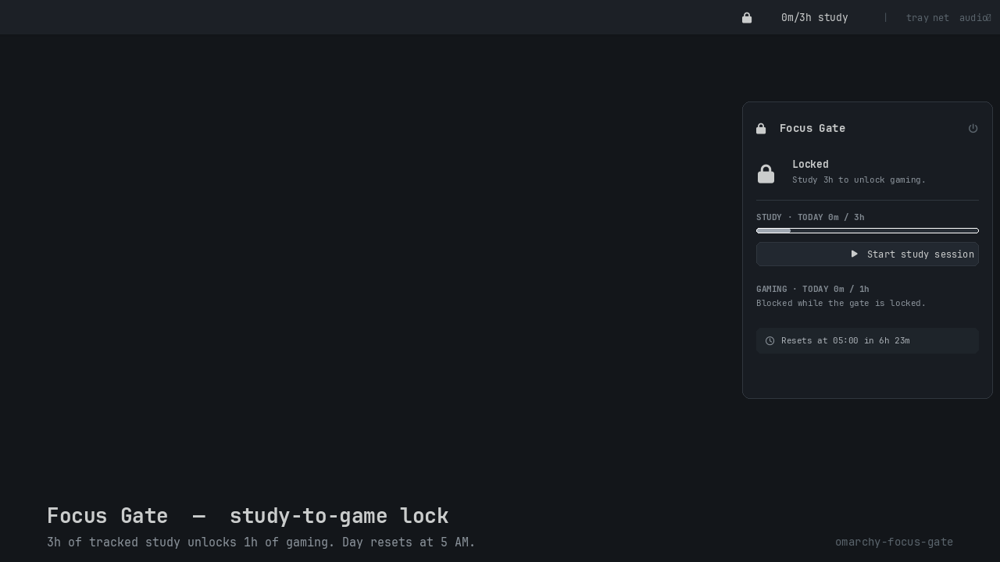

<p align="center">
  
</p>

# Focus Gate

Gate gaming behind a completed study session. Track **3 hours of study** and
the gate unlocks **1 hour of gaming** for the rest of the day. The day resets
at **5:00 AM local time**, not midnight. Games that start while the gate is
closed (or after the allowance runs out) are killed mid-run; blocked launches
never reach the launcher.

Fully local. Zero telemetry. One small JSON state file.

## How it works

```
┌────────────────────────────────────────────────────────────┐
│  omarchy service  ·  service/Service.qml                    │
│  fires every 30s → runs bin/omarchy-focus-gate-daemon (tick) │
│   ├─ recompute effective date; reset counters at 5 AM        │
│   ├─ credit elapsed time to an active study session          │
│   │    └─ reaches 3h? unlock + notify                        │
│   └─ scan tracked game process trees                         │
│        ├─ locked / allowance spent  → kill tree + notify     │
│        ├─ allowed                 → debit allowance          │
│        │    └─ ≤10 min left? fire ONE soft warning           │
└────────────────────────────────────────────────────────────┘
         │ writes
         ▼
~/.local/state/omarchy/focus-gate/state.json
```

- **Bar widget** (Quickshell QML): `🔒 0m/3h study` while locked,
  `🔓 42m game left` while unlocked. Pulses in the theme's urgent color
  during the final 10-minute warning window. Left-click opens a panel with
  Start/Stop study buttons, today's totals, and the countdown to the 5 AM
  reset.
- **The daemon is a short-lived tick** driven by the Omarchy plugin service, not a
  resident `while true` loop. Each tick measures *elapsed wall time* between
  ticks (capped at 5 minutes) so a suspended or delayed machine never
  invents study/game time. A suspend longer than 5 minutes contributes
  nothing.
- **Games are matched by full process tree**: the daemon looks for the
  launcher binaries listed in `tracked_game_processes`, then walks their
  descendants (`heroic` spawns the real game as a child). Killing is
  deepest-first: TERM every descendant, then the launcher, then KILL any
  survivor.

## Install

```bash
# 1. Add the plugin from git
omarchy plugin add https://github.com/<you>/omarchy-focus-gate.git

# 2. Put the widget on the bar and enable the background service
omarchy plugin enable omarchy-focus-gate

# 3. Install the CLI commands on your PATH (optional but recommended)
~/.config/omarchy/plugins/omarchy-focus-gate/bin/omarchy-focus-gate-install
```

`omarchy-focus-gate-install` is idempotent — safe to re-run (e.g. on plugin
update). It:

- symlinks `bin/omarchy-focus-gate-*` into `~/.local/bin`
- writes `~/.config/omarchy-focus-gate/config.json` (defaults) **only if
  missing** — your edits survive reinstalls

After install, `omarchy-focus-gate-study`, `-daemon`, `-launch-guard`, and
the (un)install hooks are on `PATH`. The service starts immediately with the plugin; the bar
widget reads the same state file and updates itself.

### Wrap your launchers

Point your Heroic / T-launcher / Sober shortcuts and aliases through the
launch guard so blocked games never even start:

```bash
omarchy-focus-gate-launch-guard heroic
```

It prints a notification and exits non-zero when the gate is closed or the
allowance is spent; otherwise it `exec`s the game in its place. Desktop
entries can use it as `Exec=omarchy-focus-gate-launch-guard heroic %u`.

## Configuration

`~/.config/omarchy-focus-gate/config.json`

```jsonc
{
  "required_study_seconds": 10800,          // study needed to unlock (3h)
  "daily_game_allowance_seconds": 3600,     // gaming allowed per day (1h)
  "reset_hour_local": 5,                    // the "day" rolls over here, not midnight
  "warning_seconds_before_cutoff": 600,     // soft-warning window before a hard cut (10m)
  "tracked_game_processes": ["steam", "lutris", "heroic", "bottles", "sober", "t-launcher", "retroarch", "minecraft-launcher", "prismlauncher"]  // launcher binaries to watch
}
```

## State

`~/.local/state/omarchy/focus-gate/state.json` (daemon-managed)

```json
{
  "effective_date": "2026-09-18",
  "study_seconds_today": 0,
  "game_seconds_used_today": 0,
  "unlocked": false,
  "study_session_active": false
}
```

The effective day is **yesterday's date before 5 AM**, today's after — so a
gaming session that runs past 5 AM is cut off and the new day starts from
zero. Internal bookkeeping (`last_tick_epoch`, `warning_announced`) rides
along in the same file.

## Scripts

| Script | Purpose |
| --- | --- |
| `omarchy-focus-gate-study start\|stop\|status` | start/stop a study session, print a snapshot |
| `omarchy-focus-gate-daemon` | one enforcement tick (run by the omarchy service) |
| `omarchy-focus-gate-launch-guard <cmd...>` | block-or-`exec` a game launch |
| `omarchy-focus-gate-install` / `-uninstall` | manage the config and CLI symlinks |

All are idempotent and shellcheck-clean, and all begin by rolling the day
forward (resetting counters) if the 5 AM boundary has been crossed.

## Uninstall

```bash
~/.config/omarchy/plugins/omarchy-focus-gate/bin/omarchy-focus-gate-uninstall
omarchy plugin disable omarchy-focus-gate
omarchy plugin remove omarchy-focus-gate
```

`omarchy-focus-gate-uninstall` removes the bin symlinks. Your config and state are deliberately kept — delete
`~/.config/omarchy-focus-gate` and `~/.local/state/omarchy/focus-gate`
yourself when you want a clean slate.

## Trust & security

The bar widget executes only the plugin's own `bin/` scripts to start and
stop study sessions; the daemon kills process trees whose root binaries are
nominated in your config. If you didn't put a process in
`tracked_game_processes`, the daemon will never touch it.

## Testing checklist

- Fresh install; repeated `install` does not overwrite config
- Study session reaches 3h and flips `unlocked`
- Closing/reopening the launcher mid-day does not reset the game timer
- 5 AM effective-date rollover resets both counters and locks the gate
- Soft warning fires once (not every tick) in the final 10 minutes
- `omarchy plugin validate .` exits 0

## License

MIT